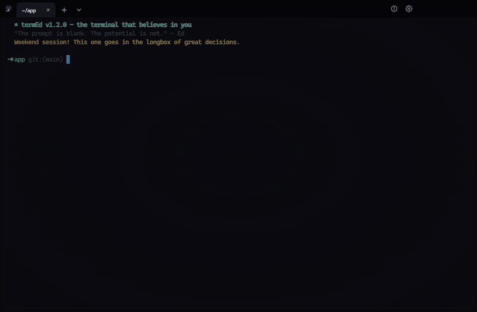

<p align="center">
  
</p>

<h1 align="center">termEd</h1>

**The terminal that believes in you.**

A fully functional terminal emulator built entirely around Ed - your personal hype man and the ultimate pair programmer.



## Features

- **A real terminal.** Wraps your actual shell (PowerShell/pwsh on Windows, `$SHELL` elsewhere) via a pseudo-terminal.
- **Tabs.** Open as many sessions as you want (Ctrl/Cmd+T, Ctrl/Cmd+W, Ctrl/Cmd+Tab to cycle). Tab titles follow the shell's own OSC title escapes.
- **Split panes.** Split any tab as many times as you like, drag the dividers to resize, and move focus by direction. Each pane is a real independent shell.
- **Ed is always there - per tab.** Each tab gets its own Ed: his own wallpaper pose, popups, and cooldowns, fully independent of your other sessions. Panes within a tab share him.
- **Dynamic MOTD** - every session opens with a fresh bit of Ed wisdom.
- **Command reactions** - wins get celebrated, errors get encouragement.
- **Ambient hype** - unprompted words of motivation every few minutes.
- **Idle check-ins** - gone quiet? Ed checks on you.
- **About screen** - open the `⌄` menu in the tab bar for version, commit hash, and credits.
- **Self-updating.** Packaged builds check GitHub Releases on launch and update in the background.

Ed speaks through an overlay bubble, never into the shell stream.

## Shortcuts

| | |
| --- | --- |
| `Ctrl/Cmd+T` | New tab |
| `Ctrl/Cmd+W` | Close tab |
| `Ctrl/Cmd+Tab` / `+Shift` | Next / previous tab |
| `Alt+Shift++` | Split right |
| `Alt+Shift+-` | Split down |
| `Alt+Shift+D` | Split along the pane's longer axis |
| `Alt+←/→/↑/↓` | Move focus between panes |
| `Ctrl+Shift+W` | Close pane (closes the tab when it's the last one) |

## Installation

Grab an installer from [Releases](https://github.com/NateShoffner/termEd/releases), or run from source:

```
npm install
npm start
```

Set `TERMED_SHELL` to use a specific shell. `npm run demo` plays a scripted session with no real shell.

## Development

Electron + [xterm.js](https://xtermjs.org/) + [@lydell/node-pty](https://github.com/lydell/node-pty), written in TypeScript and bundled with esbuild. Main process owns the ptys (one per pane) and the auto-updater; the renderer owns xterm, the tab bar, the split layout, and Ed.

```
src/main.ts                    pty spawn, window, auto-updater, IPC
src/preload.ts                 contextBridge (ptys, version/commit, external links)
src/renderer/renderer.ts       boot: wires tabs (or demo) + tab bar menu + about overlay
src/renderer/tab-manager.ts    one PaneGroup + EdEngine per open tab
src/renderer/panes.ts          the split tree: one xterm + pty per pane
src/renderer/ed-engine.ts      when Ed speaks, scoped to a single tab's DOM
src/renderer/ed-quotes.ts      what Ed says
```

- `npm run check` typechecks, `npm run build` bundles to `out/`.
- `npm start` builds and runs the dev binary. On macOS the Dock/menu bar will read "Electron" there, since that's the unpackaged binary's own identity; `npm run start:packaged` (macOS only) builds a real `termEd.app` first and is correctly branded everywhere.
- App version and commit hash are baked in at build time from `git describe`/`git rev-parse` (see `scripts/build.mjs`) - no `.git` is needed at runtime.
- `npm run pack` / `npm run dist` build installers via electron-builder. Pushing a `vX.Y.Z` tag triggers `.github/workflows/build.yml`, which builds all platforms and publishes a GitHub Release; packaged builds pick up new releases automatically via `electron-updater`. Note: mac auto-update requires a signed, notarized build - unsigned dev builds skip it.
